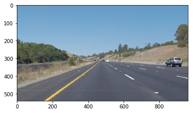
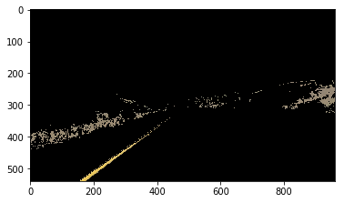
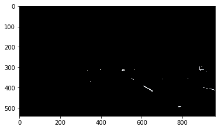
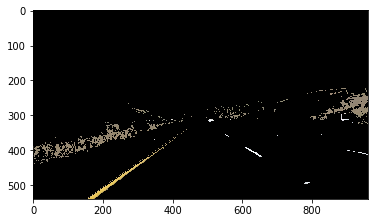
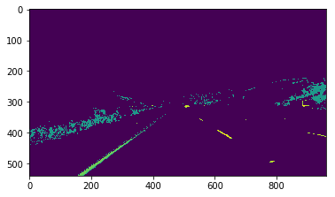
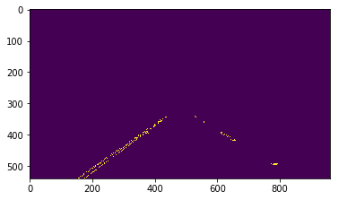
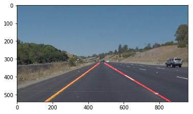

# **Finding Lane Lines on the Road**

The goals / steps of this project are the following:
* Make a pipeline that finds lane lines on the road
* Reflect about the solution, its shortcomings and possible improvements.

### Pipeline Overview

Each image or video frame is processed following the steps:
1. Filter only white and yellow image channels;
2. Create a join image with white and yellow channels;
3. Convert image to grayscale;
4. Apply Canny filter to detect edges;
5. Isolate only a region of image (lane lines are located at the center and botton);
6. Call Hough algorithm to detect lines;
7. Filter detect lines in step 5 to consider only lines with *correct* slope;
8. Group filtered lines in two groups: left lines and right lines;
9. For each group, calculate the *mean* line;
10. Extrapolate the *mean* lean to cross the bottom border and goes to the middle height;

### Each Step Explained
Let's visualize the pipeline showing the result for each step. Consider the original image:

In **step 1** we get two images, one selecting the yellow channel:

Another image with white channel:

In **step 2**, we join yellow and white images:

In **step 3**, we convert to grayscale:

Now, in **step 4**, we apply Canny filter to detect edges:

In **step 5**, we isolate only the area of interest:

Following, **steps 6 through 10**, we do:
- execute Hough algorithm to detect lines in image;
- select lines with *correct* slope (absolute value between 0.5 and 10.0) [*draw_lines function*];
- using slope direction, classify them in two groups: right lines and left lines [*draw_lines function*];
- find the *mean* line for each group [*draw_lines function*];
- extrapolate these lines to cross the horizontal line at the bottom (x axis) and horizontal line in the middle [*draw_lines function*];

Finally, we obtain:

Now, we can join original image and lane lines image:

### Shortcomings

The main drawback of this method is it detects only straight lines, but real lanes could be curved too. The movie *challenge.mp4* shows a car driving in a highway turning right, it is ease to see that our pipeline fails to detect the *correct* lane. Another shortcoming is not to work well when there is not contrast between lane lines and the pavement.

### Possible Improvements

I believe that the most effective and cheap improvement would be calculate the lanes getting the current image but considering previous frames too. The reason is that lanes do not change abrupt in short period of time.
Other obvious improvement is detect curved lanes (there is an Hough procedure to detect curved lines).
